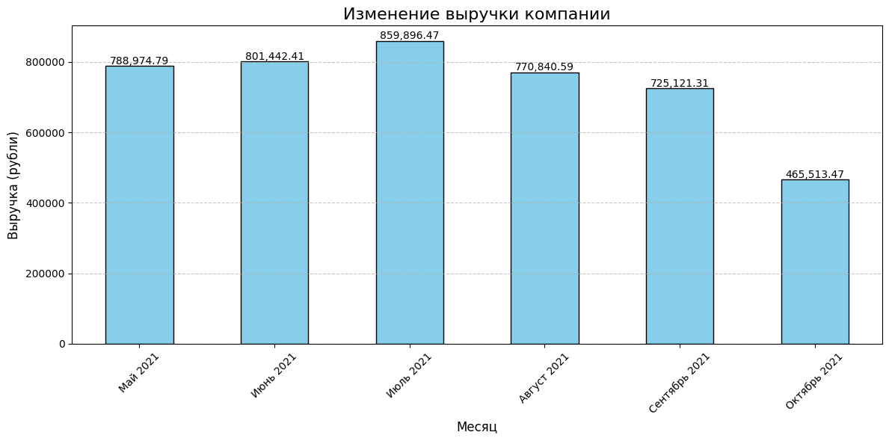

# Требования
Для работы программы необходимо установить следующие библиотеки:
- pandas
- matplotlib
- openpyxl

Установите их командой:
```bash
pip install -r requirements.txt
```
# Как использовать проект

1. Подготовка данных
Для работы программы используйте файл `data.xlsx`, содержащий данные о сделках. Убедитесь, что файл имеет соответствующую структуру  и находится в той же папке, что и файл `main.py`

2. Запуск программы
Чтобы запустить проект, выполните следующую команду:
```bash
python main.py
```

# Результаты анализа

1. **Общая выручка за июль 2021**: 859,896.47 руб.

2. **Изменение выручки компании по месяцам**:  
   

3. **Лучший менеджер за сентябрь 2021**: Смирнов, выручка: 205,258.30 руб.

4. **Преобладающий тип сделок в октябре 2021**: текущая

5. **Оригиналов договора по майским сделкам, полученных в июне 2021**: 76

# Результаты задачи
### Бонусы для менеджеров на 01.07.2021:

| sale        | bonus (руб.) |
|-------------|--------------|
| Андреев     | 5364.59      |
| Васильев    | 541.88       |
| Иванов      | 2872.20      |
| Кузнецова   | 4058.36      |
| Петрова     | 8705.16      |
| Селиванов   | 588.87       |
| Смирнов     | 4538.22      |
| Филимонова  | 682.80       |


